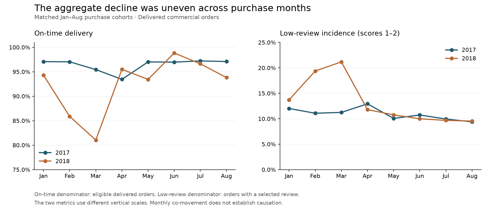
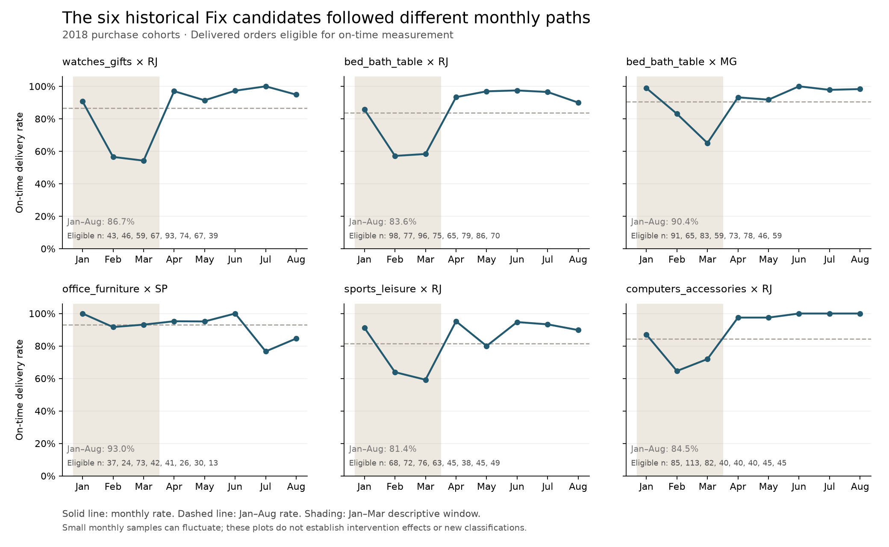
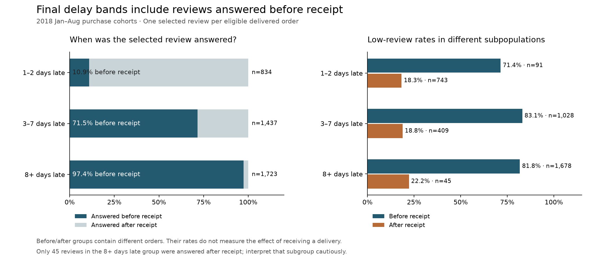

# Olist：增长、交付与市场优先级

中文论证讨论稿，2026-10-05。用于确定研究结构，不是已确认的网页文案，也没有修改或发布页面。

## 开篇：问题是怎样形成的

我在 Samsung 接触了较大规模的销售数据，主要使用 Excel。后来学习 SQL 时，练习通常已经给出了需要回答的问题。我希望进一步学习的是，怎样面对一份陌生数据，判断什么值得研究。

Olist 提供了这样的机会。我没有带着一个预设的研究问题开始，而是先了解交易、商品、卖家、客户、交付和评价记录能够支持哪些观察。比较成交与服务表现后，我逐渐形成了一个问题：在成交规模增长、总体交付与评价表现转弱的情况下，哪些品类与客户州组合值得优先关注，进一步增长前又需要验证什么？

这是一项基于历史交易的研究。项目开展于 2026 年，主要比较的是 2017、2018 年一至八月购买群体中的已交付订单。成交指标采用商品价格总和作为 GMV proxy；它能够描述样本中的商品交易规模，不能代表 Olist 的平台收入或利润。

## 一、成交增长了，服务表现怎样变化？

两期同期比较中，已交付商品 GMV 从 R$2.99M 增至 R$7.22M，增长 141.13%。订单数从 21,998 增至 52,783，而每单商品价值仅增长约 0.49%。以订单数与平均订单价值进行对称分解，订单数量项占 GMV 增量的 99.40%。这说明成交扩张主要体现在订单规模上；分解本身没有识别获客、营销或需求变化的原因。

服务结果没有同向改善。准时率从 96.50% 降至 92.27%，低评分率从 10.59% 升至 13.37%。这里的准时率相对预计日期计算，低评分指每单选中评价中的一至二分，两者使用各自符合条件的订单作为分母。

不过，总体差异没有完整描述变化过程。2018 年二、三月的准时率明显低于去年同期，四月和六月则高于去年同期。月份占比变化不能完全解释总体下降；按相同月份权重比较，差异仍然存在。客户州组成也没有解释下降：州权重变化反而抵消了约 0.21 个百分点，州内准时率变化贡献约 −4.45 个百分点。两种分解分别检验不同组成问题，不能把它们的贡献相加。

这支持同时监测成交、交付和评价，也提示需要定位问题发生的时间与业务范围。它尚不足以说明订单增长造成了交付恶化。预计日期设置，以及州内品类、卖家和路线组成变化，仍可能影响比较。

**本节证据：** [同期指标原始复算](2026-10-05-raw-followup/summary.json)、[州组成分解](2026-10-05-raw-followup/state_decomposition.csv)；原项目 `dashboard/data/monthly_trend.csv`。图表须明确使用购买月份，而非配送完成月份。

图注：购买月份对应已交付订单群体。交付与评价使用不同分母和纵轴尺度；月度共同变化不能证明因果。

## 二、哪些市场值得关注，问题是否还在发生？

为了把总体观察转为具体的调查对象，我以品类 × 客户州作为主要比较单位，同时查看商业规模、交付和评价。原研究采用公开的样本资格与同伴分位规则，将六个较大规模、交付或评价较弱的市场列为 Fix 候选。它们覆盖 2,920 个市场内订单计数、R$409,170.12 商品 GMV 和 405 个市场内晚到订单计数。金额表示这些市场的交易暴露，不是损失或可追回收入；跨品类的订单计数不能默认与总体 distinct orders 相同。

但累计表现只能筛选对象，不能直接决定当前行动。检查月度轨迹后，候选市场之间出现了重要差异。

`watches_gifts × RJ` 的准时率从一至三月的 65.54% 上升到四至八月的 95.88%；`computers_accessories × RJ` 从 73.57% 上升到 99.05%。这些市场值得进一步确认恢复是否持续，以及早期问题与后期变化涉及什么组成或流程，而不能仅凭八个月汇总认定仍需统一限制增长。

`office_furniture × SP` 呈现不同方向：后期准时率从 94.78% 降至 91.45%，但低评分率从 26.87% 降至 16.00%。七、八月还出现较低准时率，不过分别只有 30 单和 13 单，适合作为调查线索，不能单凭月度比率形成稳定排序。

其他候选也不能被一个“恢复”标签概括。`bed_bath_table × RJ` 后期整体准时率改善，但八月仍出现交付和评价风险信号。原 Grow、Defend 示例同样存在后期波动：八月 `stationery × SP` 的准时率为 87.21%（86 单），`health_beauty × SP` 为 87.84%（370 单）。这意味着保护与增长候选也需要最近表现的检查。

这些比较不是已验证的新分类：本研究没有重算每个后期窗口的全体同伴门槛，前后窗口也不是治疗组与对照组。它们改变的是下一步调查问题——需要区分早期暴露、恢复、复发线索和样本不足，而非把累计标签直接转为长期行动。

**本节证据：** [市场月度计数与比率](2026-10-05-raw-followup/candidate_monthly.csv)、[两窗口比较](2026-10-05-raw-followup/candidate_windows.csv)。

## 三、路线和评价能够解释什么？

路线视角能够进一步缩小调查范围。SP→RJ 在原合格高晚到路线中具有最大的晚到订单暴露。订单级核对也确认，它与部分 RJ 候选市场存在较大交集：`watches_gifts × RJ` 的 65 个晚到订单中，60 个包含 SP 卖家；`bed_bath_table × RJ` 的 106 个中有 103 个。但 `computers_accessories × RJ` 的 76 个中只有 33 个，说明同一客户州内的市场可能需要不同诊断。

这些交集支持优先检查相关交接和预计日期设置，却不能归责某个承运商。路线记录只有卖家州与客户州；一个订单也可能涉及多个卖家。SP→RJ 的中位处理与运输时长代理未超过同伴 P75，因此预计日期、交易组成和尾部时长都应进入检查范围。

延迟与评价也存在明显关联。最终晚到三至七天的已评价订单，低评分率为 64.79%；最终晚到八天以上为 80.21%。分别按品类、单卖家路线、卖家或购买月份进行有限条件比较后，差距仍然存在。

然而，评价时间改变了这些数字的业务含义。晚到三至七天的订单中，71.54% 的选中评价回答早于最终收货；晚到八天以上的订单中，这一比例为 97.39%。因此，原比率描述的是最终严重晚到订单的评价，其中大量回答发生在等待收货期间，不能描述为收货后的满意度。

仅保留收货后回答评价的子样本，差距明显较小，但子样本的构成也改变了，不能将差距缩小归因于评价时点。等待、未收到商品和沟通值得调查；具体原因、问卷发送机制以及最终延迟程度的独立作用仍未确认。对于准时率未触发弱交付门槛、但低评分较高的市场，还需要检查交付之外的解释。

**本节证据：** [市场与 SP 卖家的交集](2026-10-05-raw-followup/candidate_SP_origin.csv)、[评价时间](2026-10-05-raw-followup/review_timing.csv)、[条件比较及保留样本](2026-10-05-raw-followup/conditional_review_comparison.csv)。完整五个延迟组、分母与收货前后子样本放配套证据表。

图注：收货前后是不同订单子群体，不能把比率差距解释为收货的效果；晚到至少八天的收货后评价只有 45 条。

## 四、这些观察怎样转为行动？

原来的分类规则仍有价值：它把规模、交付、评价与样本资格同时纳入，读者也可以追溯候选是如何形成的。但这些门槛是研究规则；六个 Fix、两个 Grow 并不是唯一正确的名单。单项小幅调整交付与评价分位门槛时，名单保持不变；改变高规模划线或订单资格后，行动标签会变化。

因此，我将规则分类作为第一轮筛选，再以最近表现和诊断线索决定需要验证什么。

| 候选对象 | 建议先做什么 | 行动前需要确认什么 |
|---|---|---|
| 累计弱表现、后期明显恢复的市场 | 核对恢复过程并继续监测 | 恢复是否持续，是否来自组成或预计日期变化 |
| 最近仍有风险信号的市场 | 检查具体月份、路线和卖家 | 样本是否足够、风险是否复发、哪个环节值得测试 |
| 较大规模的保护候选 | 持续监测规模与服务表现 | 最近交付表现、供给容量和集中度 |
| 表现较强的增长候选 | 设计有限的增量测试 | 最近表现、可用供给、费用和对照安排 |

这不是一份已经实施的运营计划。具体增长或修复测试需要明确实际负责人、可操作的改变、观测周期、对照安排和停止条件。资料中缺少完整成本、容量、库存和 treatment 记录，所以本研究还不能计算净收益，也不能证明某项修复有效。

**本节证据：** [分类门槛核对](2026-10-05-priority-threshold-check.md)；原研究分类 SQL。上述安排是下一步验证建议，不是重新估计的最优资源分配。

## 五、研究最终能够回答什么？

这份数据支持将成交规模与服务结果共同用于市场初筛，也表明累计标签需要由时间信息补充。部分历史风险市场已经恢复，部分保护或增长候选在后期出现新的信号。路线和评价记录能够帮助定位调查问题，但不能代替根因验证。

因此，我能够提出需要优先核对的市场，以及进一步增长前应验证的条件。对于真实的资源分配，仍需补充成本、容量、机制和干预资料，并在行动后观察结果。R$409K 是历史交易暴露，同伴差距是算术基准；两者都不是已经证明能够追回的收益。

## 正文与附录的分工

正文保留真实起点、同期与月度变化、少量市场轨迹、路线与评价时间的关键反例，以及有限行动。州组成分解在正文解释结果，详细计算放附录。

附录保留完整分类及优先顺序、门槛敏感性、所有市场表、非可加总粒度、评价选择与时间规则、条件比较的样本覆盖、复现脚本及图表来源。卖家完整名单保留为诊断附录，不把独立名单写成市场问题的已确认根因。

首页保留个人缘起和最少必要发现，并用一句话引出详细研究：累计表现帮助识别调查对象，时间与评价记录进一步改变了判断。首页不承担完整规则和机制说明。
